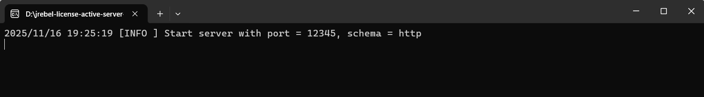
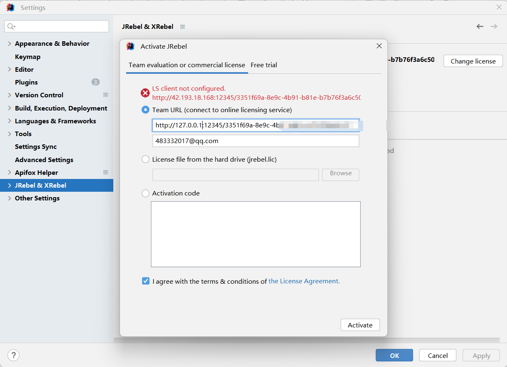

---

title: JRebel 2025.4.1激活
date: 2025-11-16 15:34:05
author: EverSpring
top: false
toc: false
mathjax: false
categories: JAVA
tags:
  - JRebel
  - Java
---

<br/>

# 环境与背景

IDEA 2023.3.6，JRebel 2024.2.4，代码工程 springboot 3.4.7
通过JRebel启动时出现以下异常，原因就是当前的JRebel版本不支持Tomcat 10，最好是升级JRebel版本，不要去动代码
```
org.apache.catalina.core.ContainerBase   : A child container failed during start

java.util.concurrent.ExecutionException: org.apache.catalina.LifecycleException: Failed to initialize component [StandardEngine[Tomcat].StandardHost[localhost].TomcatEmbeddedContext[]]
    at java.base/java.util.concurrent.FutureTask.report(FutureTask.java:122)
    at java.base/java.util.concurrent.FutureTask.get(FutureTask.java:191)
    at org.apache.catalina.core.ContainerBase.startInternal(ContainerBase.java:756)
    at org.apache.catalina.core.StandardHost.startInternal(StandardHost.java:772)
    at org.apache.catalina.util.LifecycleBase.start(LifecycleBase.java:164)
    at org.apache.catalina.core.ContainerBase$StartChild.call(ContainerBase.java:1203)
    at org.apache.catalina.core.ContainerBase$StartChild.call(ContainerBase.java:1193)
    at java.base/java.util.concurrent.FutureTask.run(FutureTask.java:264)
    at org.apache.tomcat.util.threads.InlineExecutorService.execute(InlineExecutorService.java:75)
    at java.base/java.util.concurrent.AbstractExecutorService.submit(AbstractExecutorService.java:145)
    at org.apache.catalina.core.ContainerBase.startInternal(ContainerBase.java:749)
    at org.apache.catalina.core.StandardEngine.startInternal(StandardEngine.java:203)
    at org.apache.catalina.util.LifecycleBase.start(LifecycleBase.java:164)
    at org.apache.catalina.core.StandardService.startInternal(StandardService.java:412)
    at org.apache.catalina.util.LifecycleBase.start(LifecycleBase.java:164)
    at org.apache.catalina.core.StandardServer.startInternal(StandardServer.java:870)
    at org.apache.catalina.util.LifecycleBase.start(LifecycleBase.java:164)
    at org.apache.catalina.startup.Tomcat.start(Tomcat.java:438)
    at org.springframework.boot.web.embedded.tomcat.TomcatWebServer.initialize(TomcatWebServer.java:128)
    at org.springframework.boot.web.embedded.tomcat.TomcatWebServer.<init>(TomcatWebServer.java:107)
    at org.springframework.boot.web.embedded.tomcat.TomcatServletWebServerFactory.getTomcatWebServer(TomcatServletWebServerFactory.java:517)
    at org.springframework.boot.web.embedded.tomcat.TomcatServletWebServerFactory.getWebServer(TomcatServletWebServerFactory.java:219)
    at org.springframework.boot.web.servlet.context.ServletWebServerApplicationContext.createWebServer(ServletWebServerApplicationContext.java:193)
    at org.springframework.boot.web.servlet.context.ServletWebServerApplicationContext.onRefresh(ServletWebServerApplicationContext.java:167)
    at org.springframework.context.support.AbstractApplicationContext.__refresh(AbstractApplicationContext.java:621)
    at org.springframework.context.support.AbstractApplicationContext.jrLockAndRefresh(AbstractApplicationContext.java:41002)
    at org.springframework.context.support.AbstractApplicationContext.refresh(AbstractApplicationContext.java:42008)
    at org.springframework.boot.web.servlet.context.ServletWebServerApplicationContext.refresh(ServletWebServerApplicationContext.java:146)
    at org.springframework.boot.SpringApplication.refresh(SpringApplication.java:752)
    at org.springframework.boot.SpringApplication.refreshContext(SpringApplication.java:439)
    at org.springframework.boot.SpringApplication.run(SpringApplication.java:318)
    at org.springframework.boot.SpringApplication.run(SpringApplication.java:1361)
    at org.springframework.boot.SpringApplication.run(SpringApplication.java:1350)
Caused by: org.apache.catalina.LifecycleException: Failed to initialize component [StandardEngine[Tomcat].StandardHost[localhost].TomcatEmbeddedContext[]]
    at org.apache.catalina.util.LifecycleBase.handleSubClassException(LifecycleBase.java:406)
    at org.apache.catalina.util.LifecycleBase.init(LifecycleBase.java:125)
    at org.apache.catalina.util.LifecycleBase.start(LifecycleBase.java:155)
    at org.apache.catalina.core.ContainerBase$StartChild.call(ContainerBase.java:1203)
    at org.apache.catalina.core.ContainerBase$StartChild.call(ContainerBase.java:1193)
    at java.base/java.util.concurrent.FutureTask.run(FutureTask.java:264)
    at org.apache.tomcat.util.threads.InlineExecutorService.execute(InlineExecutorService.java:75)
    at java.base/java.util.concurrent.AbstractExecutorService.submit(AbstractExecutorService.java:145)
    at org.apache.catalina.core.ContainerBase.startInternal(ContainerBase.java:749)
    ... 31 common frames omitted
Caused by: java.lang.NoSuchMethodError: 'boolean org.apache.catalina.webresources.TestResourceSet.isPathMounted(java.lang.String, java.lang.String)'
    at org.apache.catalina.webresources.TestResourceSet.listWebAppPaths(AbstractArchiveResourceSet.java:118)
    at org.apache.catalina.webresources.TestResourceSet.doTest(AbstractArchiveResourceSet.java:41001)
    at org.zeroturnaround.javarebel.catalina.JrTestResourceSet$1.run(SourceFile:37)
    at org.zeroturnaround.javarebel.catalina.JrTestResourceSet$1.run(SourceFile:33)
    at org.zeroturnaround.javarebel.integration.util.SecurityController.doWithoutSecurityManager(SourceFile:29)
    at org.zeroturnaround.javarebel.catalina.JrTestResourceSet.checkPatchNeeded(SourceFile:33)
    at org.apache.catalina.webresources.TestResourceSet.isPatchNeeded(AbstractArchiveResourceSet.java:42001)
    at org.apache.catalina.webresources.AbstractArchiveResourceSet.<clinit>(AbstractArchiveResourceSet.java)
    at org.apache.catalina.webresources.StandardRoot.createWebResourceSet(StandardRoot.java:396)
    at org.apache.catalina.webresources.StandardRoot.createWebResourceSet(StandardRoot.java:360)
    at org.springframework.boot.web.embedded.tomcat.TomcatServletWebServerFactory$StaticResourceConfigurer.addResourceSet(TomcatServletWebServerFactory.java:864)
    at org.springframework.boot.web.embedded.tomcat.TomcatServletWebServerFactory$StaticResourceConfigurer.addResourceJars(TomcatServletWebServerFactory.java:841)
    at org.springframework.boot.web.embedded.tomcat.TomcatServletWebServerFactory$StaticResourceConfigurer.lifecycleEvent(TomcatServletWebServerFactory.java:828)
    at org.apache.catalina.util.LifecycleBase.fireLifecycleEvent(LifecycleBase.java:109)
    at org.apache.catalina.util.LifecycleBase.setStateInternal(LifecycleBase.java:389)
    at org.apache.catalina.util.LifecycleBase.init(LifecycleBase.java:121)
    ... 38 common frames omitted
```
# JRebel激活
JRbel升级到了2025.4.1，以前用的是`https://jrebel.qekang.com/`来激活，这种激活不用下载任何东西，直接配置就可以。现在升级需要先下载一个代理  
* 第一步：下载JRebel激活服务器  
访问GitHub开源项目：https://github.com/yu-xiaoyao/jrebel-license-active-server
根据你的操作系统选择对应版本下载。
* 第二步：生成guid，可通过 https://www.guidgen.com/ 生成
* 第三步：运行激活服务器
下载完成后，直接双击运行即可。程序启动后会显示代理端口信息（默认端口为12345）

* 第四步：JRebel中激活，地址为http://127.0.0.1:12345/生成的guid，邮箱随便填


# 其他
* 关闭自动激活

👽个人博客：https://everspring.github.io/
👽公众号：爱历史的IT男
