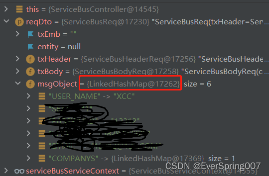
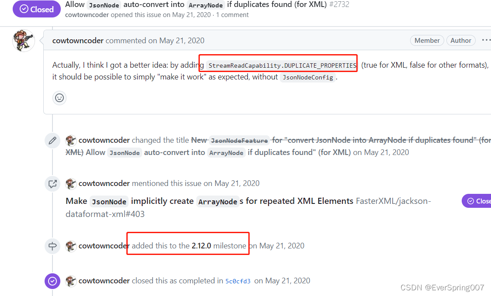

---

title: jackson解析有数组的xml，解析对象不固定的问题
date: 2022-04-09 15:34:05
author: EverSpring
top: false
toc: false
mathjax: false
categories: JAVA
tags:
  - jackson
  - Java
---

<br/>

# 环境

springboot版本2.2.11.RELEASE，jackson version为**2.10.0** 

以下为第一版样例代码，后面XML不会变，ServiceBusReq类的内容会变:

- 请求体

```xml
<TX> 
  <TX_HEADER> 
    <SYS_HDR_LEN/>  
    <SYS_PKG_VRSN>01</SYS_PKG_VRSN>-->
  </TX_HEADER> 
  <TX_EMB/>  
  <ENTITY> 
    <USER_NAME>xcc</USER_NAME> 
    <COMPANYS>
        <COMPANY>
            <COMPANYNAME>NAME-1</COMPANYNAME>
        </COMPANY>
        <COMPANY>
            <COMPANYNAME>NAME-2</COMPANYNAME>
        </COMPANY>
     </COMPANYS>
  </ENTITY> 
</TX>
```

- 实体类

```java
@Data
@JacksonXmlRootElement(localName = "TX")
public class ServiceBusReq<T> {
    @JacksonXmlProperty(localName = "TX_HEADER")
    private ServiceBusHeaderReq txHeader;
    @JacksonXmlProperty(localName = "TX_BODY")
    private ServiceBusBodyReq txBody;
    @JacksonXmlProperty(localName = "TX_EMB")
    private String txEmb;
    @JacksonXmlProperty(localName = "ENTITY")
    private T msgObject;    
}

@Data
@JacksonXmlRootElement(localName = "TX_HEADER")
public class ServiceBusHeaderReq {
    @JacksonXmlProperty(localName = "SYS_HDR_LEN")
    private String sysHdrLen;
}

@RestController
public class ServiceBusController {
    @RequestMapping(method = {RequestMethod.POST},value = "/service",consumes = MediaType.APPLICATION_XML_VALUE)
    public ServiceBusResp xmlService(@RequestBody @Valid ServiceBusReq reqDto) throws ClassNotFoundException {
       return serviceBusService.invoke(reqDto);
    }
}

@Data
@Builder
public class XmlDemoReqDto {
    @JacksonXmlProperty(localName = "USER_NAME")
    private String UserName;
    @JacksonXmlProperty(localName = "COMPANYS")
    private List<Company> companys;
}

@Data
@JacksonXmlRootElement(localName = "company")
public class Company {
    @JacksonXmlProperty(localName = "COMPANYNAME")
    private String companyName;
}
```

**ServiceBusReq采用的泛型，反序列化ENTITY的对象是不固定的。XmlDemoReqDto 就是ServiceBusReq的泛型对象**

# 问题阶段一

controller中reqDto打印的msgObject类型实际上是一个LinkedHashMap，而LinkedHashMap明显不符合序列化后是个java bean的要求

**解决方法：**
添加一个ObjectNode接收，然后把objectNode再转换成msgObject，代码如下：

```java
@Data
@JacksonXmlRootElement(localName = "TX")
public class ServiceBusReq<T> {
    @JacksonXmlProperty(localName = "TX_HEADER")
    private ServiceBusHeaderReq txHeader;
    @JacksonXmlProperty(localName = "TX_BODY")
    private ServiceBusBodyReq txBody;
    @JacksonXmlProperty(localName = "TX_EMB")
    private String txEmb;
    @JacksonXmlProperty(localName = "ENTITY")
    private ObjectNode entity;
    private T msgObject;    
}

/*转换方法*/
private Req convert(ObjectNode entityStr) throws ClassNotFoundException {
        Type[] actualTypeArguments = ((ParameterizedTypeImpl) this.getClass().getGenericSuperclass()).getActualTypeArguments();
        if (actualTypeArguments.length != 2) {
            throw new ServiceException("对象获取异常");
        }
        Object o = xmlMapper.convertValue(entityStr, Class.forName(actualTypeArguments[0].getTypeName()));
        return (Req) o;
    }
```

# 问题阶段二

以上处理反序列化成对象，但有另一个问题，companys只获取到一个第二个节点，也就是NAME-2的值，NAME-1的值没有获取到


# 问题阶段三

只获取到一个节点，有两个地址修改：
1. 修改jackson-databind的版本，需要改为2.12.0版本以上，官方做了处理


2. 修改XmlDemoReqDto的定义，代码修改后如下：

```java
@Data
@Builder
public class XmlDemoReqDto {
    @JacksonXmlProperty(localName = "USER_NAME")
    private String UserName;
    // 此处有变更
    @JacksonXmlProperty(localName = "COMPANYS")
    private Companys companys;
}

// 新增一个Companys的对象，里面包含company list
@Data
public class Companys {
    @JacksonXmlProperty(localName = "COMPANY")
    private List<Company> companies;
}

@Data
public class Company {
    @JacksonXmlProperty(localName = "COMPANYNAME")
    private String companyName;
}
```

按照上面的处理方式，可以正常解析出两个company了


# 问题阶段四

以上方法在传入的XML中company如果是两个节点，那是正常的，但如果只有一个节点，也就是下面那种，就会出现解析失败的情况，出现异常“java.lang.IllegalArgumentException: Cannot deserialize value of type java.util.ArrayList<Company> from Object value (token JsonToken.START_OBJECT)”。因为jackson处理时把companys解析成了一个普通对象，而非list。解决方法：在Companys对象中添加@JsonFormat(with = JsonFormat.Feature.ACCEPT_SINGLE_VALUE_AS_ARRAY)。代码见下面

```xml
<TX> 
  <TX_HEADER> 
    <SYS_HDR_LEN/>  
    <SYS_PKG_VRSN>01</SYS_PKG_VRSN>
  </TX_HEADER> 
  <TX_EMB/>  
  <ENTITY> 
    <USER_NAME>xcc</USER_NAME> 
    <COMPANYS>
        <COMPANY>
            <COMPANYNAME>NAME-1</COMPANYNAME>
        </COMPANY>
     </COMPANYS>
  </ENTITY> 
</TX>
```

```java
@Data
public class Companys {
    @JacksonXmlProperty(localName = "COMPANY")
    @JsonFormat(with = JsonFormat.Feature.ACCEPT_SINGLE_VALUE_AS_ARRAY)
    private List<Company> companies;
}
```

处理以上四个阶段问题，消耗了我整整一天的时间，希望能给遇到相同问题的朋友一些解决思路。再次感谢ChatGPT在处理问题中给的一些思路，太有用了。
**勉励：未来被人工智能淘汰的不是工程师，而是不会运用人工智能的工程师**

# 参考链接

https://github.com/FasterXML/jackson-databind/issues/2733
https://github.com/FasterXML/jackson-databind/issues/2732
https://github.com/FasterXML/jackson-dataformat-xml/issues/339

<br/>

👽个人博客：https://everspring.github.io/
👽公众号：爱历史的IT男
